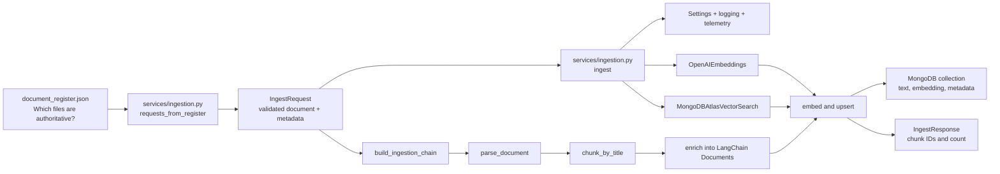
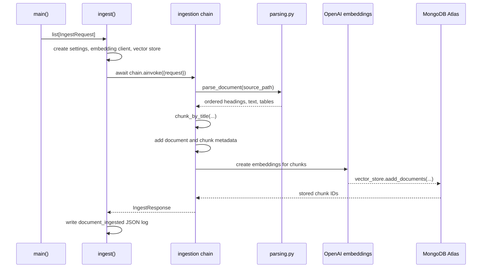

# NexaAssist `app/` component guide

## What this application does today

This repository is in **Phase 1: document ingestion**. It takes approved bank-policy documents, breaks them into meaningful pieces, creates an embedding (a numeric meaning representation) for every piece, and stores those pieces in MongoDB Atlas Vector Search.

It does **not** yet expose a FastAPI API, a Streamlit interface, or a question-answering/RAG chain. Those are planned later layers. The only executable application flow today is the ingestion command.

## Big picture



In ordinary language: the service reads the document register, turns each listed source file into a validated request, then sends it through a reusable pipeline. That pipeline reads the file, preserves sections and tables while splitting it into chunks, labels each chunk, and saves it to the vector database.

## Directory map

| Location | Responsibility | Simple explanation |
| --- | --- | --- |
| `app/core/` | Shared runtime setup | Loads settings, configures structured logs, and optionally enables monitoring. |
| `app/models/` | Data contracts | Defines the exact shape of data entering and leaving the ingestion flow. |
| `app/chains/` | Pure LangChain processing | Parses source files, creates embeddings, and builds the ingestion pipeline. It deliberately has no web/UI code. |
| `app/database/` | MongoDB-only setup | Connects to the correct collection and describes the required Atlas index. |
| `app/services/` | Application orchestration | Wires all pieces together for the command-line ingestion job. |
| `app/**/__init__.py` | Python package markers | Empty files that let Python import these directories as packages. |

## Starting the ingestion job

The command-line entry point is `app.services.ingestion.main`:

```bash
python -m app.services.ingestion nexa_synthetic_data/document_register.json
```

`main()` expects exactly one argument: the path to the document register JSON file. It then performs these steps:

1. `get_settings()` loads settings from `.env`.
2. `configure_logging()` makes logs JSON-shaped for a log platform such as Datadog.
3. `init_telemetry()` enables Datadog instrumentation only when `DD_TRACE_ENABLED=true`.
4. `requests_from_register()` makes one `IngestRequest` for each authoritative document.
5. `asyncio.run(ingest(...))` runs the asynchronous ingestion workflow.

The `nexa_synthetic_data/document_register.json` file is the document catalogue. Its `authoritative` field is important: `requests_from_register()` skips entries where it is false. It also converts the document-ID prefix `POL` or `CIR` into the readable `doc_type` values `policy` and `circular`.

## How a single document moves through the code



The `await` keywords matter because embedding and database writing are I/O work. They allow this code to use asynchronous LangChain/MongoDB operations rather than block the event loop while a remote service responds.

## Component-by-component explanation

### `app/core/config.py` — one place for configuration

**Class: `Settings(BaseSettings)`**

This Pydantic Settings class defines all environment configuration the application needs. It reads `.env` automatically, validates types, and prevents secrets from being casually displayed because passwords/API keys use `SecretStr`.

Important groups of fields:

- MongoDB: `mongodb_uri`, `mongodb_db`, `mongodb_collection`, `vector_index_name` decide where chunks are saved.
- OpenAI: `openai_api_key`, `embedding_model`, `embedding_dimensions`, `embedding_batch_size` decide how vectors are generated.
- Chunking: `chunk_max_characters` is the upper size target for a section chunk.
- Metadata: `institution`, `jurisdiction`, and `confidentiality_level` are stamped onto every chunk.
- Operations: `log_level` and `dd_trace_enabled` control logging and tracing.

**Function: `get_settings()`**

Creates and returns the `Settings` object. `@lru_cache` means repeated calls in the same process reuse the same validated settings object instead of re-reading `.env`.

### `app/core/logging.py` — machine-readable logs

**Function: `configure_logging(level)`**

Sets up `structlog` to output JSON logs to standard output. JSON logs are easier for Datadog and other log systems to search by fields such as `doc_id`, `chunk_count`, or `policy_version`.

### `app/core/telemetry.py` — optional Datadog tracing

**Function: `init_telemetry(enabled)`**

Does nothing unless telemetry is enabled. When it is enabled, it calls `ddtrace.patch_all()`, which instruments supported libraries such as PyMongo. This lets Datadog measure database calls and later web requests.

### `app/models/ingestion.py` — the input and output contracts

**Class: `IngestRequest(BaseModel)`**

Represents one source document to ingest. It includes the file path and document-level business metadata: ID, title, version, dates, product, jurisdiction, document type, and confidentiality level. `extra="forbid"` rejects unexpected fields, helping catch malformed input early.

**Class: `IngestResponse(BaseModel)`**

Represents a successful ingestion result: the source `doc_id`, number of chunks saved, their deterministic IDs, and the embedding model used.

### `app/chains/embeddings.py` — create the embedding client

**Function: `get_embeddings(settings)`**

Builds LangChain's `OpenAIEmbeddings` client with the configured model, vector dimension, batch size, and API key. The same configuration must be used for ingestion and future retrieval; otherwise stored vectors and search queries would be incompatible.

### `app/chains/parsing.py` — turn a file into meaningful elements

**Function: `parse_document(path)`**

The public parsing entry point. For a PDF it calls `_parse_pdf`; for other supported formats it delegates to Unstructured's `partition()` function.

**Function: `_parse_pdf(path)`**

The custom path for born-digital PDFs. It uses `pdfplumber` because policy tables and headings need special treatment:

- Removes a fixed top and bottom page margin so recurring headers/footers are not indexed as policy content.
- Detects the most common font size as body text; larger text becomes a `Title` (a heading).
- Groups nearby body-text lines into `NarrativeText` paragraphs.
- Extracts ruled tables as whole tables instead of breaking their cells apart.
- Sorts everything by page and vertical position to restore reading order.

**Function: `_table_element(rows)`**

Normalizes empty cells, creates safe HTML using `escape()`, and returns an Unstructured `Table`. HTML is retained because it preserves the relationship between columns, such as an income range and its corresponding fee or threshold.

### `app/chains/ingestion.py` — the reusable LangChain pipeline

**Function: `build_ingestion_chain(vector_store, settings)`**

Returns a LangChain `Runnable`, rather than running immediately. This makes the pipeline testable and composable. Its input must be `{"request": IngestRequest}` and callers run it asynchronously with `await chain.ainvoke(...)`.

The returned chain has four named internal steps:

| Step | Internal function | Input → output | Why it exists |
| --- | --- | --- | --- |
| Parse | `parse` | request → Unstructured elements | Reads the source file through `parse_document()`. |
| Chunk | `chunk` | elements → section-aware chunks | Uses `chunk_by_title`; starts new chunks at headings and protects tables from being mixed with surrounding prose. |
| Enrich | `enrich` | chunks → LangChain `Document` objects | Adds metadata and stable IDs such as `POL-HL-V3_c001`. Tables use HTML as their `page_content`; text uses plain text. |
| Embed and upsert | `embed_and_upsert` | documents → `IngestResponse` | Calls the vector store's async `aadd_documents()` method, which generates embeddings and writes the results. |

`RunnablePassthrough.assign(...)` carries a shared state dictionary through the first three steps while adding `elements`, then `chunks`, then `documents`. `RunnableLambda(...)` adapts ordinary Python functions into LangChain runnable steps. The `run_name` values make trace views easier to read in a tracing platform.

Stable chunk IDs are a deliberate design decision. Sending the same document again uses the same IDs, so it replaces existing chunks rather than creating duplicate search results.

### `app/database/mongo.py` — connect LangChain to MongoDB Atlas

**Function: `get_vector_store(settings, embedding)`**

Creates a PyMongo `MongoClient`, selects the configured database and collection, then wraps that collection in `MongoDBAtlasVectorSearch`.

The wrapper is the bridge between LangChain and MongoDB Atlas. It knows:

- `text_key="text"`: where the original chunk content is stored.
- `embedding_key="embedding"`: where the numerical vector is stored.
- `index_name`: which Atlas Vector Search index to query in the future.
- `relevance_score_fn="cosine"`: how similarity is measured.
- `auto_create_index=False`: the application never silently changes database indexes; an operator creates the index deliberately.

### `app/database/indexes.md` — required database index

This file is an operations instruction, not executable Python. It contains the exact Atlas Vector Search index JSON to create manually. Its vector dimension must equal `EMBEDDING_DIMENSIONS`. It also makes selected metadata filterable: product, jurisdiction, effective date, and confidentiality level.

If the embedding model or dimensions change, the guide correctly requires a new index version and a complete re-embedding. Vectors of different dimensions cannot live in one search index.

### `app/services/ingestion.py` — orchestrate the application flow

**Constant: `DOC_TYPES`**

Maps compact register prefixes to application-friendly values: `POL → policy` and `CIR → circular`.

**Function: `requests_from_register(register_path, settings)`**

Reads `document_register.json`, filters to authoritative entries, resolves each relative source-file path, and converts each entry into an `IngestRequest`. It supplies corpus-wide metadata from `Settings` and per-document metadata from the register.

**Function: `async ingest(requests)`**

The central coordinator. It loads settings once, creates the embedding client and vector store once, builds one reusable chain, then runs each request through it in order. After each success, it emits a structured `document_ingested` log and returns all `IngestResponse` objects.

**Function: `main()`**

The thin command-line adapter described earlier. It does startup setup and starts `ingest()`; document processing logic remains outside the CLI function.

## Libraries and why they are present

| Library | Used in | Purpose in this project |
| --- | --- | --- |
| `pydantic` / `pydantic-settings` | config and models | Validates configuration and request/response data. |
| `langchain-core` | ingestion chain | Supplies `Document`, `Runnable`, and vector-store interfaces. |
| `langchain-openai` | embeddings | Calls OpenAI to make semantic vectors. |
| `langchain-mongodb` | database | Provides the official LangChain MongoDB Atlas Vector Search adapter. |
| `pymongo` | database | Creates the low-level MongoDB collection connection. |
| `pdfplumber` | PDF parser | Reads PDF text layout and detects tables. |
| `unstructured[md]` | parser and chunker | Represents document elements and chunks them by title; handles non-PDF formats. |
| `structlog` | service/logging | Produces structured JSON events. |
| `ddtrace` | telemetry | Sends supported library traces to Datadog when enabled. |
| `pytest` | tests only | Verifies ingestion behavior without OpenAI or MongoDB. |

## Metadata stored on every chunk

`enrich()` builds each LangChain `Document` with the original text/table plus metadata. This enables future RAG retrieval to search only appropriate documents—for example, a specific product, jurisdiction, date range, or confidentiality level.

| Metadata | Source | Meaning |
| --- | --- | --- |
| `doc_id`, `title`, `policy_version`, dates, `product_id`, `supersedes` | document register | Identifies the source policy and its version history. |
| `institution`, `jurisdiction`, `confidentiality_level` | `.env` / `Settings` | Identifies the corpus and access/retrieval boundaries. |
| `doc_type` | register ID prefix | Distinguishes a policy from a circular. |
| `chunk_id` | chain | Stable per-chunk identifier. |
| `section_type` | chain | `text` or `table`, so downstream code can treat tables carefully. |
| `embedding_model` | settings | Records which model created the vector. |

## Tests: what the current code proves

`tests/test_ingestion.py` uses LangChain's in-memory vector store and deterministic fake embeddings. Therefore the tests validate the application's parsing, chunking, metadata, and ID behavior without contacting OpenAI or MongoDB.

They confirm that:

- The register becomes the expected ingestion requests.
- Every synthetic document can be parsed and chunked.
- Required metadata is applied to every chunk.
- Policy-version metadata is preserved.
- Tables retain their complete HTML rows.
- Repeated page headers/footers are excluded.
- Re-ingesting a document does not create duplicates.

Run them with:

```bash
uv run pytest
```

## Boundaries to preserve as the project grows

- Keep parsing, chunking, embedding, and RAG logic inside `app/chains/`.
- Keep MongoDB client and Atlas index knowledge inside `app/database/`.
- Keep FastAPI routers thin: they should call services, not parse PDFs or query MongoDB directly.
- Keep a future Streamlit UI focused on rendering and calling APIs; it should not define chains.
- Keep `.env` private. Use `.env.example` as the safe template for required settings.

This separation means each part has one clear job, can be tested in isolation, and can be replaced without rewriting the entire application.
