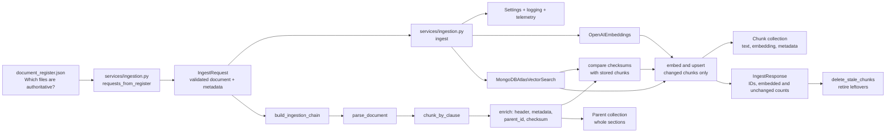
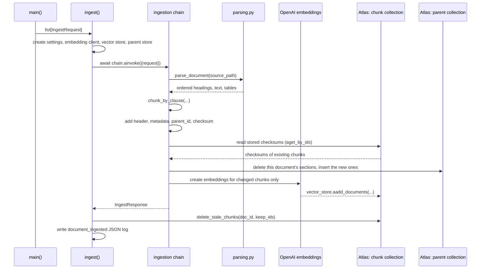

# NexaAssist `app/` component guide

## What this application does today

This repository is in **Phase 1: document ingestion** (Sessions 1 and 2). It takes approved bank-policy documents, breaks them into one chunk per numbered clause, creates an embedding (a numeric meaning representation) for every new or changed chunk, and stores those chunks in MongoDB Atlas Vector Search. It also stores each whole section as a "parent" document, so a later retrieval step can return the section around a matching clause.

It does **not** yet expose a FastAPI API, a Streamlit interface, or a question-answering/RAG chain. Those are planned later layers. The only executable application flow today is the ingestion command.

### Which session built what

| Session | Topic | Where it lives |
| --- | --- | --- |
| 1 | Architecture, ingestion service contract, load and parse | `models/ingestion.py`, `services/ingestion.py`, `chains/parsing.py`, `chains/embeddings.py`, `database/mongo.py` |
| 2 | Hybrid chunking (structure first, size second) | `chains/chunking.py` |
| 2 | Identity header, clause-based chunk ID, checksum | `enrich` and `chunk_checksum` in `chains/ingestion.py` |
| 2 | Parent documents | `enrich` in `chains/ingestion.py`, `get_parent_store` in `database/mongo.py` |
| 2 | Incremental indexing | `compare` and `embed_and_upsert` in `chains/ingestion.py`, `delete_stale_chunks` in `database/mongo.py` |

Each session also has a standalone teaching notebook at the project root (`phase1_session1_ingestion.ipynb`, `phase1_session2_chunking.ipynb`). The notebooks do not import `app/`; they repeat the same stages cell by cell.

## Big picture



In ordinary language: the service reads the document register, turns each listed source file into a validated request, then sends it through a reusable pipeline. That pipeline reads the file, splits it into one chunk per clause (keeping each table with its clause), labels and fingerprints each chunk, embeds only the chunks whose fingerprint changed, and saves them to the vector database. Finally the service removes chunks that the source document no longer contains.

## Directory map

| Location | Responsibility | Simple explanation |
| --- | --- | --- |
| `app/core/` | Shared runtime setup | Loads settings, configures structured logs, and optionally enables monitoring. |
| `app/models/` | Data contracts | Defines the exact shape of data entering and leaving the ingestion flow. |
| `app/chains/` | Pure LangChain processing | Parses source files, chunks them by clause, creates embeddings, and builds the ingestion pipeline. It deliberately has no web/UI code. |
| `app/database/` | MongoDB-only setup | Connects to the chunk and parent collections, removes stale chunks, and describes the required Atlas index. |
| `app/services/` | Application orchestration | Wires all pieces together for the command-line ingestion job. |
| `app/**/__init__.py` | Python package markers | Empty files that let Python import these directories as packages. |

## Starting the ingestion job

The command-line entry point is `app.services.ingestion.main`:

```bash
uv run --env-file .env python -m app.services.ingestion nexa_synthetic_data/document_register.json
```

`main()` expects exactly one argument: the path to the document register JSON file. It then performs these steps:

1. `get_settings()` loads settings from `.env`.
2. `configure_logging()` makes logs JSON-shaped for a log platform such as Datadog.
3. `init_telemetry()` enables Datadog instrumentation only when `DD_TRACE_ENABLED=true`.
4. `requests_from_register()` makes one `IngestRequest` for each authoritative document.
5. `asyncio.run(ingest(...))` runs the asynchronous ingestion workflow.

Each document produces one JSON log line:

```json
{"doc_id": "POL-HL-V3", "chunk_count": 32, "embedded_count": 32, "unchanged_count": 0, "stale_chunks_removed": 0, "embedding_model": "text-embedding-3-small", "policy_version": "3.0", "effective_date": "2025-10-01", "event": "document_ingested", "level": "info", "timestamp": "..."}
```

| Field | Meaning |
| --- | --- |
| `chunk_count` | Clause chunks the document produced on this run. |
| `embedded_count` | Chunks that were new or changed, so were sent to the embedding model. |
| `unchanged_count` | Chunks whose stored checksum matched, so were skipped. |
| `stale_chunks_removed` | Chunks deleted because the document no longer produces them. |

For the synthetic corpus a first run gives 177 chunks in total (31, 31, 32 for the three home loan versions, 8 for the circular, 18, 19, 17 and 21 for the others) and 80 parent sections. A second run reports `embedded_count: 0` for every document.

The `nexa_synthetic_data/document_register.json` file is the document catalogue. Its `authoritative` field is important: `requests_from_register()` skips entries where it is false. It also converts the document-ID prefix `POL` or `CIR` into the readable `doc_type` values `policy` and `circular`.

## How a single document moves through the code



The `await` keywords matter because embedding and database writing are I/O work. They allow this code to use asynchronous LangChain/MongoDB operations rather than block the event loop while a remote service responds.

Four situations show what the compare step saves:

| Situation | What is embedded | What is deleted |
| --- | --- | --- |
| Same document ingested again | Nothing | Nothing |
| One clause reworded | That clause's chunk only | Nothing |
| One clause withdrawn | Nothing | That clause's chunk |
| `EMBEDDING_MODEL` changed | Every chunk | Nothing (and a new Atlas index version is needed) |

## Component-by-component explanation

### `app/core/config.py` — one place for configuration

**Class: `Settings(BaseSettings)`**

This Pydantic Settings class defines all environment configuration the application needs. It reads `.env` automatically, validates types, and prevents secrets from being casually displayed because passwords/API keys use `SecretStr`.

Important groups of fields:

- MongoDB: `mongodb_uri`, `mongodb_db`, `mongodb_collection`, `vector_index_name` decide where chunks are saved; `mongodb_parent_collection` is where whole sections are saved.
- OpenAI: `openai_api_key`, `embedding_model`, `embedding_dimensions`, `embedding_batch_size` decide how vectors are generated.
- Chunking: `chunk_max_characters` is the size above which a clause is split, and `chunk_overlap_characters` is how much text is repeated between the pieces.
- Metadata: `institution`, `jurisdiction`, and `confidentiality_level` are stamped onto every chunk.
- Operations: `log_level` and `dd_trace_enabled` control logging and tracing.

The environment variables behind those fields (see `.env.example`):

| Variable | Default | Used for |
| --- | --- | --- |
| `MONGODB_URI`, `MONGODB_DB`, `MONGODB_COLLECTION` | none (required) | Where chunks are written |
| `VECTOR_INDEX_NAME` | `policy_chunks_v1` | The Atlas Vector Search index, created by hand |
| `MONGODB_PARENT_COLLECTION` | `policy_sections` | Where whole sections are written |
| `OPENAI_API_KEY` | none (required) | Embedding calls |
| `EMBEDDING_MODEL`, `EMBEDDING_DIMENSIONS`, `EMBEDDING_BATCH_SIZE` | `text-embedding-3-small`, `1536`, `100` | Which vectors are made and how many texts go in one request |
| `CHUNK_MAX_CHARACTERS` | `1200` | Size above which a clause is split |
| `CHUNK_OVERLAP_CHARACTERS` | `150` | Text repeated between the pieces of a split clause |
| `INSTITUTION`, `JURISDICTION`, `CONFIDENTIALITY_LEVEL` | none (required) | Corpus-wide metadata the register does not carry |
| `LOG_LEVEL`, `DD_TRACE_ENABLED` | `INFO`, `false` | Logging and Datadog tracing |

**Function: `get_settings()`**

Creates and returns the `Settings` object. `@lru_cache` means repeated calls in the same process reuse the same validated settings object instead of re-reading `.env`.

### `app/core/logging.py` — machine-readable logs

**Function: `configure_logging(level)`**

Sets up `structlog` to output JSON logs to standard output. JSON logs are easier for Datadog and other log systems to search by fields such as `doc_id`, `chunk_count`, or `policy_version`.

### `app/core/telemetry.py` — optional Datadog tracing

**Function: `init_telemetry(enabled)`**

Does nothing unless telemetry is enabled. When it is enabled, it calls `ddtrace.patch_all()`, which instruments supported libraries such as PyMongo. This lets Datadog measure database calls and later web requests.

### `app/models/ingestion.py` — the input and output contracts

**Class: `IngestRequest(BaseModel)`**

Represents one source document to ingest. It includes the file path and document-level business metadata: ID, title, version, dates, product, jurisdiction, document type, and confidentiality level. `extra="forbid"` rejects unexpected fields, helping catch malformed input early.

**Class: `IngestResponse(BaseModel)`**

Represents a successful ingestion result: the source `doc_id`, number of chunks, their deterministic IDs, how many were embedded on this run (`embedded_count`), how many were skipped because their checksum matched (`unchanged_count`), and the embedding model used.

### `app/chains/embeddings.py` — create the embedding client

**Function: `get_embeddings(settings)`**

Builds LangChain's `OpenAIEmbeddings` client with the configured model, vector dimension, batch size, and API key. The same configuration must be used for ingestion and future retrieval; otherwise stored vectors and search queries would be incompatible.

### `app/chains/parsing.py` — turn a file into meaningful elements

**Function: `parse_document(path)`**

The public parsing entry point. For a PDF it calls `_parse_pdf`; for other supported formats it delegates to Unstructured's `partition()` function.

**Function: `_parse_pdf(path)`**

The custom path for born-digital PDFs. It uses `pdfplumber` because policy tables and headings need special treatment:

- Removes a fixed top and bottom page margin so recurring headers/footers are not indexed as policy content.
- Detects the most common font size as body text; larger text becomes a `Title` (a heading).
- Groups nearby body-text lines into `NarrativeText` paragraphs.
- Extracts ruled tables as whole tables instead of breaking their cells apart.
- Sorts everything by page and vertical position to restore reading order.

**Function: `_table_element(rows)`**

Normalizes empty cells, creates safe HTML using `escape()`, and returns an Unstructured `Table`. HTML is retained because it preserves the relationship between columns, such as an income range and its corresponding fee or threshold.

### `app/chains/chunking.py` — decide what a chunk is

**Function: `chunk_by_clause(elements, max_characters, overlap)`**

Turns the parser's ordered elements into `Chunk` objects using two rules, in this order:

1. **Structure first.** A heading such as `6. Fees and charges` starts a section. A paragraph starting with a clause number such as `6.2 Processing fee.` starts a clause. Anything that follows (a table, a footnote, a continuation line) belongs to that clause. Each clause becomes one chunk, so a table is never separated from the sentence that introduces it.
2. **Size second.** Only when a clause is longer than `max_characters` is it split. Its tables each become one chunk, never cut. Its narrative is split at sentence boundaries by LangChain's `RecursiveCharacterTextSplitter`, repeating up to `overlap` characters between pieces.

Text before the first numbered section (the title block and document-control table) becomes section 0, "Front matter".

Two regular expressions at the top of the file define the structure: `SECTION_TITLE` (`6. Fees and charges`) and `CLAUSE` (`6.2 Processing fee. ...`). They fit this corpus; a document numbered differently needs them extended.

With the default limit of 1,200 characters no clause in the corpus is split (the longest, with its table, is about 850 characters), so rule 2 is seen in the tests and the Session 2 notebook rather than in a normal run. The header line added later by `enrich` is not counted against the limit.

**Class: `Chunk`**

A small frozen dataclass: the chunk text plus its section number and title, clause number and heading, and whether it contains a table.

### `app/chains/ingestion.py` — the reusable LangChain pipeline

**Function: `build_ingestion_chain(vector_store, parent_store, settings)`**

Returns a LangChain `Runnable`, rather than running immediately. This makes the pipeline testable and composable. Its input must be `{"request": IngestRequest}` and callers run it asynchronously with `await chain.ainvoke(...)`.

The returned chain has five named internal steps:

| Step | Internal function | Input → output | Why it exists |
| --- | --- | --- | --- |
| Parse | `parse` | request → Unstructured elements | Reads the source file through `parse_document()`. |
| Chunk | `chunk` | elements → clause chunks | Calls `chunk_by_clause()` with the size and overlap from settings. |
| Enrich | `enrich` | chunks → child and parent `Document` objects | Children: prefixes a header line (`[POL-HL-V3 \| NexaHome Loan Policy v3.0 \| 6. Fees and charges]`), adds metadata, an ID such as `POL-HL-V3_6.2_c01`, a `parent_id` and a `checksum`. Parents: one `Document` per section holding all of its clauses. |
| Compare | `compare` | children → changed children | Reads the stored chunks with the same IDs and keeps only children whose checksum is new or different. |
| Embed and upsert | `embed_and_upsert` | changed children → `IngestResponse` | Rewrites the parent sections, then calls `aadd_documents()` for the changed children only, which generates embeddings and writes the results. |

`RunnablePassthrough.assign(...)` carries a shared state dictionary through the first four steps while adding `elements`, then `chunks`, then `enriched`, then `changed`. `RunnableLambda(...)` adapts ordinary Python functions into LangChain runnable steps. The `run_name` values make trace views easier to read in a tracing platform.

**Function: `chunk_checksum(text, metadata)`**

A SHA-256 fingerprint of a chunk's text and metadata. Because the metadata includes `embedding_model`, switching models changes every fingerprint and so forces a full re-embed instead of leaving vectors from two models in one index.

**Function: `parent_key_prefix(doc_id)`**

The shared start of a document's parent keys (`POL-HL-V3_s`), used to find and replace that document's sections.

Chunk IDs are a deliberate design decision. They are built from the clause number, so sending the same document again reuses the same IDs (replacing rather than duplicating), and adding a new clause does not change the IDs of the others.

| ID | Pattern | Example |
| --- | --- | --- |
| Chunk of a numbered clause | `{doc_id}_{clause}_c{nn}` | `POL-HL-V3_6.2_c01` |
| Second piece of a split clause | same, next index | `POL-OPS-001_2.3_c02` |
| Text outside any clause | `{doc_id}_{section number}_c{nn}` | `POL-HL-V3_0_c01` (front matter) |
| Parent section | `{doc_id}_s{NN}` | `POL-HL-V3_s06` |

The chain depends only on LangChain's `VectorStore` and `BaseStore` interfaces, not on MongoDB. That is why the tests can pass an `InMemoryVectorStore` and an `InMemoryStore` and still run the real pipeline.

### `app/database/mongo.py` — connect LangChain to MongoDB Atlas

**Function: `get_vector_store(settings, embedding)`**

Selects the configured database and collection (through one cached PyMongo `MongoClient` shared by this module), then wraps that collection in `MongoDBAtlasVectorSearch`.

The wrapper is the bridge between LangChain and MongoDB Atlas. It knows:

- `text_key="text"`: where the original chunk content is stored.
- `embedding_key="embedding"`: where the numerical vector is stored.
- `index_name`: which Atlas Vector Search index to query in the future.
- `relevance_score_fn="cosine"`: how similarity is measured.
- `auto_create_index=False`: the application never silently changes database indexes; an operator creates the index deliberately.

**Function: `get_parent_store(settings)`**

Returns a `MongoDBDocStore` over the parent collection. It is a plain key-value store: the key is the `parent_id`, the value is the section text and its metadata. Nothing in it is embedded. Its insert does not overwrite an existing key, which is why the chain deletes a document's sections before writing them again.

Nothing reads this collection yet. The read path (Session 4) will search the clause chunks and return the parent section.

**Function: `delete_stale_chunks(collection, doc_id, keep_ids)`**

Deletes the chunks of one document whose IDs were not produced by the latest ingest, and returns how many were removed. This is what stops a withdrawn clause from continuing to appear in search results.

### `app/database/indexes.md` — required database index

This file is an operations instruction, not executable Python. It contains the exact Atlas Vector Search index JSON to create manually. Its vector dimension must equal `EMBEDDING_DIMENSIONS`. It also makes selected metadata filterable: product, jurisdiction, effective date, and confidentiality level.

It also records that the parent collection needs no search index, and suggests a regular index on `doc_id` for stale-chunk removal at scale.

If the embedding model or dimensions change, the guide correctly requires a new index version and a complete re-embedding. Vectors of different dimensions cannot live in one search index.

### `app/services/ingestion.py` — orchestrate the application flow

**Constant: `DOC_TYPES`**

Maps compact register prefixes to application-friendly values: `POL → policy` and `CIR → circular`.

**Function: `requests_from_register(register_path, settings)`**

Reads `document_register.json`, filters to authoritative entries, resolves each relative source-file path, and converts each entry into an `IngestRequest`. It supplies corpus-wide metadata from `Settings` and per-document metadata from the register.

**Function: `async ingest(requests)`**

The central coordinator. It loads settings once, creates the embedding client, vector store and parent store once, builds one reusable chain, then runs each request through it in order. After each document it calls `delete_stale_chunks()` (in a worker thread, because PyMongo is synchronous), emits a structured `document_ingested` log with the embedded, unchanged and removed counts, and returns all `IngestResponse` objects.

**Function: `main()`**

The thin command-line adapter described earlier. It does startup setup and starts `ingest()`; document processing logic remains outside the CLI function.

## Libraries and why they are present

| Library | Used in | Purpose in this project |
| --- | --- | --- |
| `pydantic` / `pydantic-settings` | config and models | Validates configuration and request/response data. |
| `langchain-core` | ingestion chain | Supplies `Document`, `Runnable`, and vector-store interfaces. |
| `langchain-openai` | embeddings | Calls OpenAI to make semantic vectors. |
| `langchain-mongodb` | database | Provides the official LangChain MongoDB Atlas Vector Search adapter and the `MongoDBDocStore` used for parent sections. |
| `pymongo` | database | Creates the low-level MongoDB collection connection. |
| `pdfplumber` | PDF parser | Reads PDF text layout and detects tables. |
| `unstructured[md]` | parser | Represents document elements (`Title`, `NarrativeText`, `Table`); handles non-PDF formats. |
| `langchain-text-splitters` | chunker | Splits the narrative of an oversized clause at sentence boundaries, with overlap. |
| `structlog` | service/logging | Produces structured JSON events. |
| `ddtrace` | telemetry | Sends supported library traces to Datadog when enabled. |
| `pytest`, `mongomock` | tests only | Verify ingestion behavior without OpenAI or MongoDB; `mongomock` stands in for a collection in the stale-chunk test. |

## Metadata stored on every chunk

`enrich()` builds each LangChain `Document` with the original text/table plus metadata. This enables future RAG retrieval to search only appropriate documents—for example, a specific product, jurisdiction, date range, or confidentiality level.

| Metadata | Source | Meaning |
| --- | --- | --- |
| `doc_id`, `title`, `policy_version`, dates, `product_id`, `supersedes` | document register | Identifies the source policy and its version history. |
| `institution`, `jurisdiction`, `confidentiality_level` | `.env` / `Settings` | Identifies the corpus and access/retrieval boundaries. |
| `doc_type` | register ID prefix | Distinguishes a policy from a circular. |
| `chunk_id` | chain | Stable per-chunk identifier built from the document and clause, for example `POL-HL-V3_6.2_c01`. |
| `parent_id` | chain | Key of the whole section in the parent collection, for example `POL-HL-V3_s06`. |
| `section`, `clause`, `clause_heading` | chain | Where the chunk sits in the document; `clause` is what an answer cites. |
| `checksum` | chain | Fingerprint of text, metadata and embedding model; lets a re-run skip unchanged chunks. |
| `section_type` | chain | `text` or `table`, so downstream code can treat tables carefully. |
| `embedding_model` | settings | Records which model created the vector. |

### What one stored chunk looks like

```json
{
  "_id": "POL-HL-V3_6.2_c01",
  "text": "[POL-HL-V3 | NexaHome Loan Policy v3.0 | 6. Fees and charges]\n6.2 Processing fee. Processing fee is 0.35% of the sanctioned loan amount, subject to a minimum of ₹5,000 and a maximum of ₹15,000, plus GST.",
  "embedding": ["... 1536 floats"],
  "doc_id": "POL-HL-V3",
  "title": "NexaHome Loan Policy",
  "chunk_id": "POL-HL-V3_6.2_c01",
  "parent_id": "POL-HL-V3_s06",
  "section": "6. Fees and charges",
  "clause": "6.2",
  "clause_heading": "Processing fee",
  "institution": "NexaBank",
  "product_id": "NEXA-HL",
  "policy_version": "3.0",
  "effective_date": "2025-10-01",
  "effective_to": null,
  "supersedes": "POL-HL-V2",
  "jurisdiction": "IN",
  "doc_type": "policy",
  "section_type": "text",
  "confidentiality_level": "internal",
  "embedding_model": "text-embedding-3-small",
  "checksum": "sha256:..."
}
```

The first line of `text` is the identity header. It is embedded together with the clause, so a table or a piece of a split clause still says which document, version and section it came from.

A parent record in the parent collection has `_id` and `parent_id` (`POL-HL-V3_s06`), `page_content` (the header line followed by every clause of the section), `section`, and the same document-level fields. It has no `embedding`, `clause` or `checksum`.

## Tests: what the current code proves

`tests/test_ingestion.py` (15 tests) uses LangChain's in-memory vector store, an in-memory parent store and deterministic fake embeddings. Therefore the tests validate the application's parsing, chunking, metadata, ID and checksum behavior without contacting OpenAI or MongoDB. `delete_stale_chunks` is the one function tested against a mock MongoDB collection (`mongomock`).

They confirm that:

- The register becomes the expected ingestion requests.
- Every synthetic document can be parsed and chunked.
- Required metadata is applied to every chunk.
- Policy-version metadata is preserved.
- Tables retain their complete HTML rows.
- Repeated page headers/footers are excluded.
- Re-ingesting a document does not create duplicates.
- Every clause listed in the document register becomes exactly one chunk, and every clause cited by the golden Q&A set exists.
- Each chunk starts with its identity header and has a clause-based ID.
- An oversized clause is split with overlap while its table stays whole.
- Each parent section contains all clauses of that section, and a re-ingest replaces it cleanly.
- A re-run embeds nothing; a changed chunk or a changed embedding model is re-embedded.
- Stale chunks of a document are deleted without touching other documents.

Run them, and the lint and type checks, with:

```bash
uv run pytest -q
uv run ruff check app tests
uv run mypy app tests
```

What they do not prove: real embedding quality, Atlas index behavior, or a write to a live Atlas collection.

## Boundaries to preserve as the project grows

- Keep parsing, chunking, embedding, and RAG logic inside `app/chains/`.
- Keep MongoDB client and Atlas index knowledge inside `app/database/`.
- Keep FastAPI routers thin: they should call services, not parse PDFs or query MongoDB directly.
- Keep a future Streamlit UI focused on rendering and calling APIs; it should not define chains.
- Keep `.env` private. Use `.env.example` as the safe template for required settings.

This separation means each part has one clear job, can be tested in isolation, and can be replaced without rewriting the entire application.
